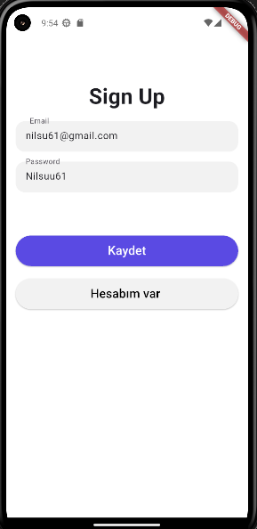
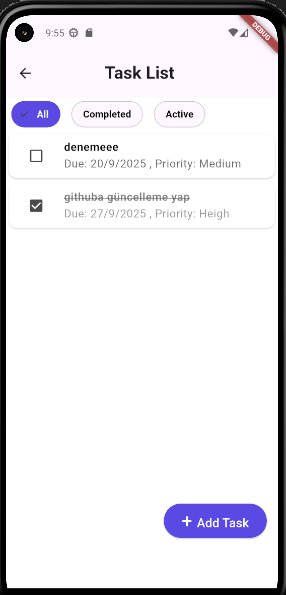

# ToDoApp

Flutter ile geliştirilmiş basit bir yapılacaklar listesi (ToDo) uygulaması.
Uygulama demosu:
## Demo
[▶ Uygulama Demosunu İzle](demo.mp4)

## Ekran Görüntüleri

| Kayıt olma Ekranı | Giriş Ekranı | Görev Listesi | Görev Ekleme | Görev Düzenleme 
|--------------|---------------|---------------|
|  |  | |  |   |

## Kurulum

##Gereksinimler 
Flutter: 3.35.3-0.0.pre-2 (channel stable)

Dart: 3.9.0

VS Code: 1.104.1 (user setup)

Android Studio: Ladybug Feature Drop | 2024.2.2 Patch 2

Emulator: Pixel 5 API 33 (Android 13.0 "Tiramisu") x86_64

## Kullanılan Paketler

firebase_core: 3.15.1

firebase_auth: 5.6.2

cloud_firestore: 5.6.11

fluttertoast: 8.2.12

image_field: 0.0.12

Projeyi çalıştırmak için :
 Bu projeyi klonlayın:
   git clone https://github.com/kullaniciadi/ToDoApp.git          ????????????????????????????????????
   cd ToDoApp
 pubspec.yaml daki  bazı paketlerin yüklenmesi için terminalde :
 flutter pub get

Emulator Kullanımı 
Ben uygulamayı Android Studio Emulator üzerinde test ettim.Siz mobil cihazınıza bağlayarak ta test edebilirsiniz.
Kullandığım Emülatör: Pixel 5 API 33 (Android 13.0 "Tiramisu") x86_64
Kodlar Visual Studio Code üzerinde yazıldı ancak emülatör Android Studio üzerinden açıldı.

VS Code → Run/Debug → emülatörü seçerek uygulamayı çalıştırabilirsiniz.

Eğer emülatörünüz yoksa, Android Studio üzerinden yeni bir sanal cihaz oluşturabilirsiniz.

Tools > Device Manager menüsünden Pixel 5 seçip Android 13 (API 33) veya istediğiniz başka bir emülatörü  indirin.

Emülatörü başlatın, ardından terminalde:
flutter run 
komutunu çalıştırın. 
Eğer sorun yaşarsanız flutter doctor komutunu çalıştırarak eksikleri görebilirsiniz.

##Proje yapısı
lib/
├── helpers/ → Yardımcı fonksiyonlar ,tekrar kullanılabilir küçük kod parçaları
├── mixins/ → Ortak özellikleri sınıflara eklemek için kullanılıyorlar
├── models/ → Veri modeli
├── screens/ → Uygulamanın ekranları
├── services/ → Firebase ile etkileşim sağlayan kısım 
├── widgets/ → Tekrar kullanılabilir özel widgetlar
├── firebase_options.dart → Firebase konfigürasyon ayarları (FlutterFire CLI ile otomatik oluşturulur)
├── main.dart → Uygulamanın giriş noktası
└── tasklist.dart → Görev listesini yöneten ekran

